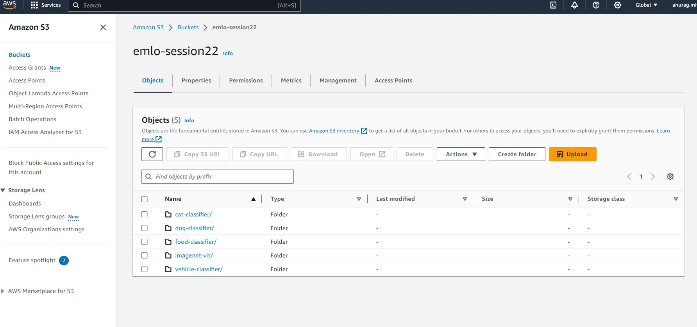
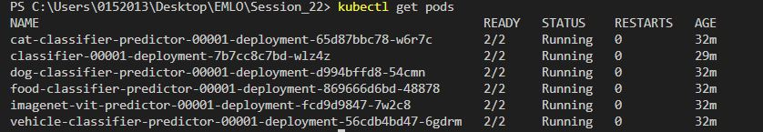
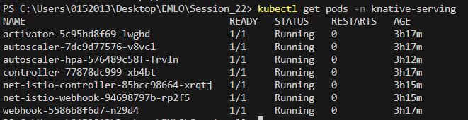
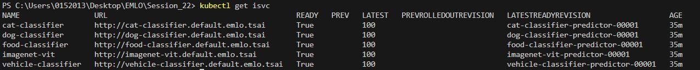
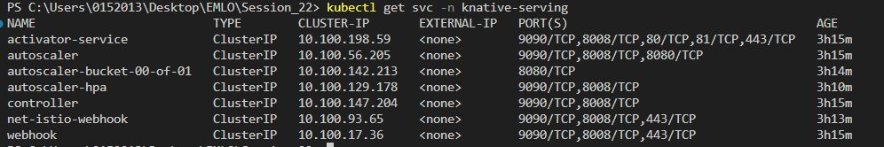
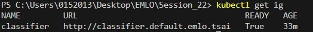
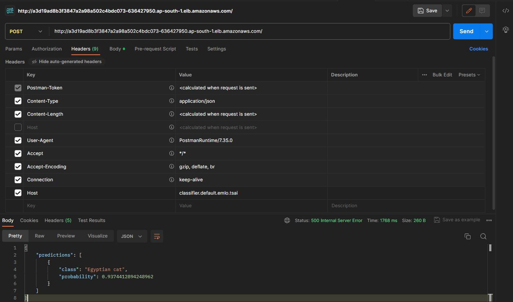

# Deployment of the multimodel inference graph using kserve

Provide an base64 image to the model and it will do the classificition base on the multimodel inference graph


![fastapi[all]](https://img.shields.io/badge/fastapi[all]-0.98.0-green)


## Objective 

- Take any 5 image classification models from hugging face
- Deploy the models on KServe and Create a KServe Inference Graph
- Create an Architecture Diagram of the Entire Deployment
- Including all Model Services
- Inference Graph Execution Flow
- Install Prometheus and Grafana in KServe to monitor workloads and requests
- Add Scaling to GPU with KNative, and GPU Time Slicing
- Benchmark the Requests Response Times with hey

## Inference Model 

Following image classifications models have been downloaded from hugging face

1. https://huggingface.co/apple/mobilevitv2-1.0-imagenet1k-256
2. https://huggingface.co/nateraw/food
3. https://huggingface.co/dima806/67_cat_breeds_image_detection
4. https://huggingface.co/skyau/dog-breed-classifier-vit
5. https://huggingface.co/dima806/vehicle_10_types_image_detection

Create a t3a.2xlarge instance with Ubuntu Base Image

## Testing on TorchServe:

First create a venv where everything will be installed:
```
virtualenv venv --python=python3.10
source venv/bin/activate
```

Install all libraries:
```
pip install -r requirements-torch.txt
pip install -r requirements.txt
```

## Create the MiniKube Cluster
```
curl -LO https://storage.googleapis.com/minikube/releases/latest/minikube-linux-amd64
sudo install minikube-linux-amd64 /usr/local/bin/minikube
```

Start the MiniKube Cluster:
```
minikube start --driver=docker --memory 28672 --cpus 8 --disk-size 180g
```

Install kubectl:
```
curl -LO "https://dl.k8s.io/release/$(curl -L -s https://dl.k8s.io/release/stable.txt)/bin/linux/amd64/kubectl"
sudo install -o root -g root -m 0755 kubectl /usr/local/bin/kubectl
```

Install KServe:
Note: This KServe Installation is only meant to be used in a local single node cluster, it’s not recommended for production use
```
curl -s "https://raw.githubusercontent.com/kserve/kserve/release-0.11/hack/quick_install.sh" | bash
```

## Deploy the models

Create mar files of all models:
```
python download_all.py
python create_mar.py
```

Create an aws s3 bucket and push the mar files:
```
aws s3 cp --recursive model-store s3://<bucket_name>/
```


Create IAM policy and role for s3 access. Get ACCESS_KEY and SECRET_ACCESS_KEY, replace it in s3.yaml file.
```
k apply -f deployment/s3.yaml
```

Deploy all models:
```
k apply -f deployment/all-classifier.yaml
```

Deploy KServe Inference Graphs:
```
k apply -f deployment/ig.yaml
```

## Deploying on EKS
Create an EKS Cluster:
```
eksctl create cluster -f eks-config.yaml
```

Install Metrics:
```
kubectl apply -f https://github.com/kubernetes-sigs/metrics-server/releases/latest/download/components.yaml
```

> Installing KNative
KNative CRDs:
```
kubectl apply -f https://github.com/knative/serving/releases/download/knative-v1.11.0/serving-crds.yaml
```

Knative Core Components:
```
kubectl apply -f https://github.com/knative/serving/releases/download/knative-v1.11.0/serving-core.yaml
```

Istio Networking Layer
```
kubectl apply -l knative.dev/crd-install=true -f https://github.com/knative/net-istio/releases/download/knative-v1.11.0/istio.yaml
kubectl apply -f https://github.com/knative/net-istio/releases/download/knative-v1.11.0/istio.yaml
```

KNative Istio Controller
```
kubectl apply -f https://github.com/knative/net-istio/releases/download/knative-v1.11.0/net-istio.yaml
```
```
kubectl patch configmap/config-domain \
      --namespace knative-serving \
      --type merge \
      --patch '{"data":{"emlo.tsai":""}}'
```

```
# KNative HPA
kubectl apply -f https://github.com/knative/serving/releases/download/knative-v1.11.0/serving-hpa.yaml

# Install Cert Manager
kubectl apply -f https://github.com/cert-manager/cert-manager/releases/download/v1.13.2/cert-manager.yaml

# Finally, Install KServe
kubectl apply -f https://github.com/kserve/kserve/releases/download/v0.11.2/kserve.yaml

# Install KServe Runtime
kubectl apply -f https://github.com/kserve/kserve/releases/download/v0.11.2/kserve-runtimes.yaml
```
```
k get pods
```


```
k get pods -n knative_serving
```

```
k get isvc
```

```
k get svc
```


```
k get ig
```


- Testing the ig classifier on postman 


- Calculated the execution time on test.py script.


## Group Members
- Anurag Mittal
- Aman Jaipuria
